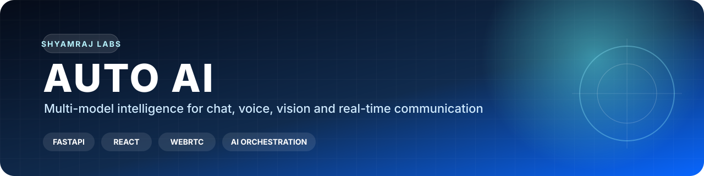
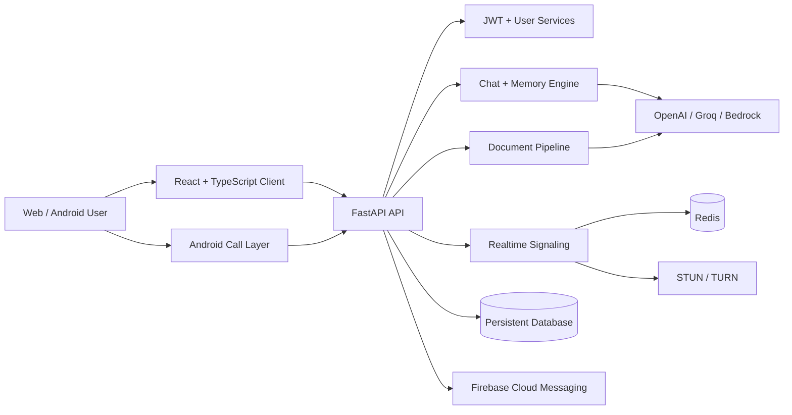

<p align="center">
  
</p>

<p align="center">
  <a href="https://github.com/shyamraj2143/auto-ai"></a>
  
  
  
</p>

<h1 align="center">Auto AI</h1>
<p align="center"><strong>A full-stack, multi-model AI assistant built for chat, documents, voice, vision, personalization and real-time communication.</strong></p>

> **Project status:** actively developed. The repository combines a production-minded FastAPI backend, React web client and Android communication layer. Runtime code and behavior are independent from this documentation presentation.

## Product snapshot

| Area | What Auto AI provides |
|---|---|
| **AI workspace** | ChatGPT-style conversations, streaming responses, Markdown, code highlighting and model/provider selection |
| **Multimodal tools** | Document upload and summarization, document chat, image analysis, speech-to-text and text-to-speech |
| **Human layer** | Adaptive tone, emotion-aware conversation, inspectable long-term memory and user-controlled personalization |
| **Communication** | Privacy-safe user discovery, WebRTC audio/video calls, Redis presence, TURN relay credentials and Android call delivery |
| **Operations** | JWT authentication, admin statistics, Docker support, persistent production data and automated Android releases |

## System architecture



## Core capabilities

### Intelligence

- Selectable OpenAI, Groq and Amazon Bedrock providers
- Streaming chat responses through a unified conversation flow
- Web search mode through Groq Compound
- Configurable image-analysis and speech-transcription models
- Code generation, debugging and explanation endpoint
- Ultra Human Mode for adaptive tone, memory, personality and relationship context

### Documents and knowledge

- PDF, TXT and DOCX upload
- AI-generated summaries
- Chat with selected uploaded documents
- Persistent chats, messages and user-owned memory APIs

### Real-time communication

- Registered-user discovery with privacy boundaries
- WebRTC audio and video calls
- Redis-backed presence, secure signaling tickets and busy locks
- Short-lived TURN relay credentials
- Android incoming-call FCM delivery and active-call foreground service

### Platform and administration

- JWT login, registration and logout
- Admin dashboard with usage and system statistics
- Light and dark themes
- Docker and Docker Compose support
- Automated Android build and release workflow
- Persistent production database safeguards

## Technology map

| Layer | Technologies |
|---|---|
| **Frontend** | React, TypeScript, Tailwind CSS, Markdown rendering, browser media APIs |
| **Backend** | Python 3.12+, FastAPI, SQLAlchemy, JWT, WebSocket/realtime services |
| **AI providers** | OpenAI, Groq, Amazon Bedrock |
| **Realtime** | WebRTC, Redis, STUN/TURN, Firebase Cloud Messaging |
| **Data** | SQLite for local development; managed SQL or volume-backed SQLite for production |
| **Delivery** | Docker, GitHub Actions, Railway-compatible deployment configuration |

## Quick start

### Requirements

- Python 3.12+
- Node.js 20+
- An API key for at least one supported AI provider

### 1. Configure environment variables

```bash
cp .env.example .env
```

Set the initial admin credentials and configure at least one provider:

```text
ADMIN_EMAIL=...
ADMIN_PASSWORD=...
ADMIN_NAME=...

AI_PROVIDER=groq
GROQ_API_KEY=...
```

### 2. Start the backend

```bash
cd backend
python -m venv .venv
```

Windows:

```powershell
.venv\Scripts\activate
pip install -r requirements.txt
uvicorn app.main:app --reload --host 0.0.0.0 --port 8000
```

macOS / Linux:

```bash
source .venv/bin/activate
pip install -r requirements.txt
uvicorn app.main:app --reload --host 0.0.0.0 --port 8000
```

### 3. Start the frontend

```bash
cd frontend
npm install
npm run dev
```

Open `http://localhost:5173`.

The first admin is created from `ADMIN_EMAIL`, `ADMIN_PASSWORD` and `ADMIN_NAME` during backend startup. Public registration creates standard user accounts.

## Docker

From the repository root:

```bash
cp .env.example .env
docker compose up --build
```

Or from the Docker folder:

```bash
cd docker
docker compose up --build
```

| Service | Local address |
|---|---|
| Frontend | `http://localhost:5173` |
| Backend health | `http://localhost:8000/api/v1/health` |

## Configuration reference

<details>
<summary><strong>AI providers and models</strong></summary>

| Variable | Purpose |
|---|---|
| `AI_PROVIDER` | Default provider: `openai`, `groq` or `bedrock` |
| `AUTO_AI_OPENAI_API_KEY` | Project-specific OpenAI API key |
| `OPENAI_MODEL` | Default OpenAI chat model |
| `GROQ_API_KEY` | Groq API key |
| `GROQ_MODEL` | Default Groq chat model |
| `GROQ_SEARCH_MODEL` | Groq search-capable model |
| `GROQ_VISION_MODEL` | Image-analysis model |
| `GROQ_AUDIO_MODEL` | Audio transcription model |
| `BEDROCK_API_KEY` | Amazon Bedrock API key |
| `BEDROCK_REGION` | Bedrock runtime region |
| `BEDROCK_MODEL` | Bedrock chat model |
| `BEDROCK_ENDPOINT_MODE` | `mantle`, `runtime` or `auto` |
| `BEDROCK_MANTLE_BASE_URL` | Optional Mantle endpoint override |
| `BEDROCK_AUTH_MODE` | `auto`, `api_key` or `aws` |
| `AWS_ACCESS_KEY_ID` | Optional SigV4 credential |
| `AWS_SECRET_ACCESS_KEY` | Optional SigV4 credential |
| `AWS_SESSION_TOKEN` | Optional temporary SigV4 credential |

</details>

<details>
<summary><strong>Application, database and communication</strong></summary>

| Variable | Purpose |
|---|---|
| `SECRET_KEY` | JWT signing secret |
| `ADMIN_EMAIL`, `ADMIN_PASSWORD`, `ADMIN_NAME` | Initial admin bootstrap values |
| `DATABASE_URL` | Managed production SQL database URL |
| `MYSQL_URL` | Railway MySQL fallback URL |
| `SQLITE_PATH` | SQLite file path; production requires a mounted volume |
| `BACKEND_CORS_ORIGINS` | Allowed frontend origins |
| `PASSWORD_RESET_*`, `SMTP_*` | Password-reset and email delivery settings |
| `CALL_FEATURE_ENABLED` | Realtime calling feature switch |
| `REDIS_URL` | Shared realtime state |
| `TURN_SERVER_URLS` | STUN/TURN endpoints |
| `TURN_SHARED_SECRET`, `TURN_REALM`, `TURN_CREDENTIAL_TTL` | Short-lived relay credential configuration |
| `FCM_PROJECT_ID`, `FCM_SERVICE_ACCOUNT_JSON` | Android background incoming-call delivery |

</details>

## Production data persistence

Production user data must not live inside the source-code directory because redeployments can replace the application filesystem.

The startup path uses additive schema creation and migrations:

- Existing tables are not dropped.
- Existing rows are not deleted.
- Missing columns are added.
- Admin bootstrap creates an account only when it does not already exist.
- Existing user and admin passwords are not reset.
- Database targets are logged in masked form without printing credentials.

### Railway SQLite volume

Use only when intentionally running SQLite in production.

```text
Mount Path: /data
```

```text
ENVIRONMENT=production
DB_BACKEND=sqlite
SQLITE_PATH=/data/auto_ai.db
```

Do not use `database/auto_ai.db` as a production path.

### Railway managed database

```text
ENVIRONMENT=production
DATABASE_URL=<managed database URL>
```

When Railway exposes `MYSQL_URL`, it can be assigned directly or copied into `DATABASE_URL`.

If production starts without a persistent database URL or a safe `/data` SQLite path, the backend fails clearly instead of silently creating a disposable local database.

## APK metadata and automatic Android releases

APK version metadata and download counts are stored in the database.

| Endpoint | Purpose |
|---|---|
| `GET /api/v1/download/apk/latest` | Latest active database version |
| `POST /api/v1/download/apk/count` | Increment download count |
| `GET /api/v1/download/apk/versions` | Version history, timestamps and counts |
| `POST /api/v1/admin/apk/version` | Admin version metadata management |

Pushes to `main` run `.github/workflows/android-release.yml`. The workflow builds a signed APK, increments `versionCode`, publishes a GitHub release and exposes the new version to mobile update checks.

Required repository secrets:

- `AUTO_AI_ANDROID_KEYSTORE_BASE64`
- `AUTO_AI_ANDROID_KEYSTORE_PASSWORD`
- `AUTO_AI_ANDROID_KEY_ALIAS`
- `AUTO_AI_ANDROID_KEY_PASSWORD`

Optional release secrets:

- `AUTO_AI_API_BASE_URL`
- `AUTO_AI_ADMIN_EMAIL`
- `AUTO_AI_ADMIN_PASSWORD`
- `AUTO_AI_GOOGLE_WEB_CLIENT_ID`
- `AUTO_AI_APK_FORCE_UPDATE`

## Documentation

- `docs/human-mode.md` — adaptive conversation architecture, prompts, APIs and memory model
- `docs/calling.md` — calling architecture, privacy boundaries, Redis/TURN/FCM deployment and verification

## Security notes

- Never commit API keys, JWT secrets, SMTP credentials or service-account JSON.
- Store production secrets in the deployment provider or GitHub Actions secrets.
- Use a managed database or mounted volume for persistent production data.
- Treat call signaling, TURN credentials and user discovery as security-sensitive surfaces.

---

<p align="center"><strong>Designed and engineered by Shyamraj.</strong></p>
