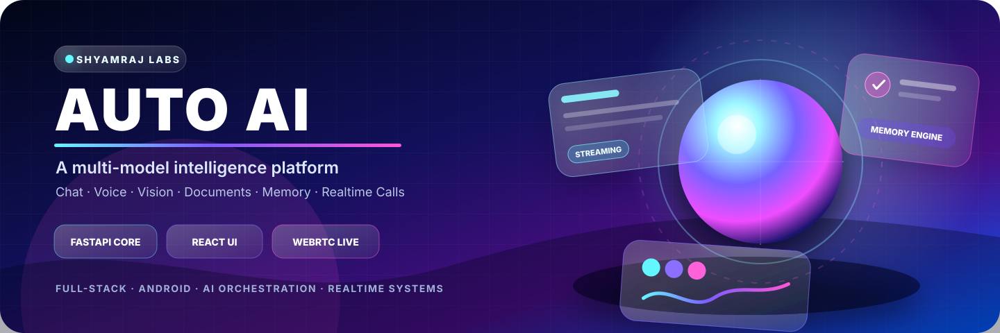
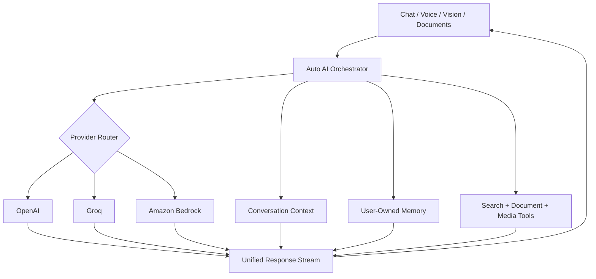
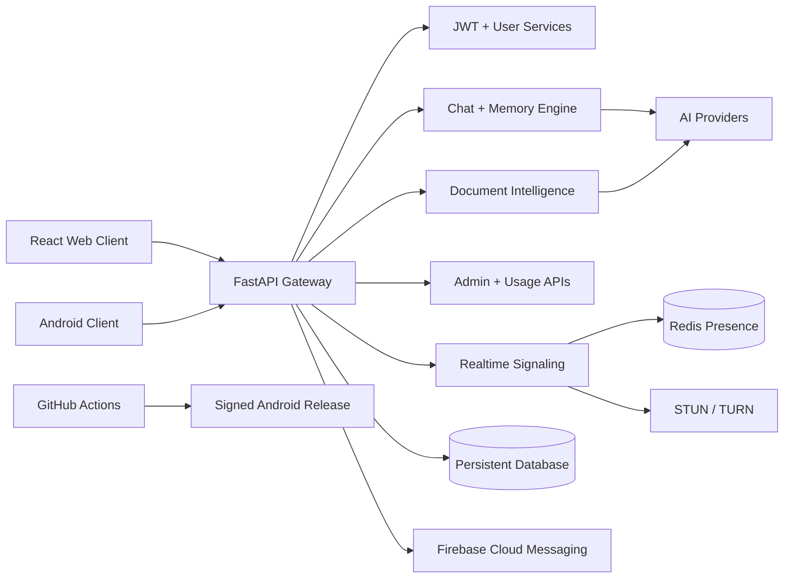
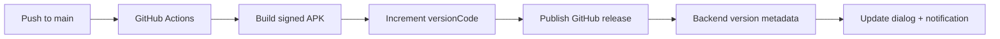

<p align="center">
  
</p>

<p align="center">
  
  
  
  
</p>

<p align="center">
  <a href="#-experience-layer">Experience</a> ·
  <a href="#-intelligence-engine">Intelligence</a> ·
  <a href="#-system-architecture">Architecture</a> ·
  <a href="#-technology-universe">Technology</a> ·
  <a href="#-launch-locally">Setup</a> ·
  <a href="#-production-readiness">Production</a>
</p>

<h1 align="center">AUTO AI</h1>
<h3 align="center">One intelligent workspace for conversation, documents, voice, vision, memory and realtime communication.</h3>

<p align="center">
  Auto AI is a full-stack AI product built around a unified assistant experience. It connects multiple AI providers with persistent conversations, multimodal tools, user-controlled memory, Android integration and secure realtime calling.
</p>

---

## ✨ Experience Layer

<table>
<tr>
<td width="33%" valign="top">

### 🧠 Adaptive Intelligence

Conversation behavior can adapt to user tone, emotion, memory and relationship context while keeping personalization inspectable and user-controlled.

</td>
<td width="33%" valign="top">

### ⚡ Multi-Model Workspace

OpenAI, Groq and Amazon Bedrock providers operate behind one assistant surface with model selection and unified streaming behavior.

</td>
<td width="33%" valign="top">

### 📡 Realtime Communication

Privacy-safe discovery, WebRTC audio/video calling, Redis presence, TURN relays and Android incoming-call delivery.

</td>
</tr>
<tr>
<td width="33%" valign="top">

### 📄 Document Intelligence

Upload PDF, TXT and DOCX files, generate summaries and continue conversations against selected documents.

</td>
<td width="33%" valign="top">

### 🎙️ Voice + Vision

Speech-to-text, text-to-speech, image analysis and browser media APIs extend the assistant beyond text.

</td>
<td width="33%" valign="top">

### 🛡️ Operations Console

Authentication, usage statistics, system monitoring, persistent data safeguards, Docker and automated Android releases.

</td>
</tr>
</table>

## 🚀 Product Command Center

| Capability | User experience | Engineering foundation |
|---|---|---|
| **AI Chat** | Streaming, Markdown, syntax highlighting and model selection | Unified provider abstraction across OpenAI, Groq and Bedrock |
| **Knowledge** | Upload, summarize and chat with documents | Persistent document pipeline and message context |
| **Memory** | Long-term personalization with user visibility and control | User-owned memory APIs and adaptive conversation engines |
| **Voice** | Browser speech input and assistant playback | Groq transcription plus browser TTS |
| **Vision** | Analyze uploaded images | Configurable vision model integration |
| **Calling** | Realtime audio/video communication | WebRTC, Redis, signaling tickets, busy locks and TURN |
| **Android** | Background call delivery and update flow | FCM, foreground service and automated release metadata |
| **Administration** | User and system visibility | JWT security, database-backed analytics and admin APIs |

## 🧠 Intelligence Engine



### Intelligence features

- Selectable OpenAI, Groq and Amazon Bedrock providers
- Streaming responses through one chat flow
- Groq Compound-powered web search mode
- Configurable image-analysis and audio-transcription models
- Code generation, debugging and explanation endpoint
- Emotion, tone, memory, personality and relationship engines
- Inspectable, editable long-term personalization

## 🌐 System Architecture



## 🎨 Interface DNA

- ChatGPT-style conversation layout
- Sidebar conversation history
- Light and dark themes
- Markdown rendering and highlighted code blocks
- Copyable assistant code output
- Streaming conversation updates
- Browser media controls
- Responsive web and Android-oriented flows

## 🪐 Technology Universe

<p align="center">
  
</p>

| Layer | Stack |
|---|---|
| **Frontend** | React, TypeScript, Tailwind CSS, Markdown, browser media APIs |
| **Backend** | Python 3.12+, FastAPI, SQLAlchemy, JWT, realtime services |
| **AI** | OpenAI, Groq, Amazon Bedrock |
| **Communication** | WebRTC, Redis, STUN/TURN, Firebase Cloud Messaging |
| **Data** | SQLite locally; managed SQL or mounted-volume SQLite in production |
| **Delivery** | Docker, GitHub Actions and Railway-compatible deployment |

## ⚙️ Launch Locally

<details open>
<summary><strong>1 — Requirements</strong></summary>

- Python 3.12+
- Node.js 20+
- At least one supported AI-provider key

</details>

<details open>
<summary><strong>2 — Environment</strong></summary>

```bash
cp .env.example .env
```

Minimum example:

```text
ADMIN_EMAIL=...
ADMIN_PASSWORD=...
ADMIN_NAME=...
AI_PROVIDER=groq
GROQ_API_KEY=...
SECRET_KEY=...
```

</details>

<details open>
<summary><strong>3 — Backend</strong></summary>

```bash
cd backend
python -m venv .venv
```

Windows:

```powershell
.venv\Scripts\activate
pip install -r requirements.txt
uvicorn app.main:app --reload --host 0.0.0.0 --port 8000
```

macOS / Linux:

```bash
source .venv/bin/activate
pip install -r requirements.txt
uvicorn app.main:app --reload --host 0.0.0.0 --port 8000
```

</details>

<details open>
<summary><strong>4 — Frontend</strong></summary>

```bash
cd frontend
npm install
npm run dev
```

Open `http://localhost:5173`.

</details>

## 🐳 Docker Launch

```bash
cp .env.example .env
docker compose up --build
```

| Service | Address |
|---|---|
| Frontend | `http://localhost:5173` |
| Backend health | `http://localhost:8000/api/v1/health` |

## 🔐 Configuration Vault

<details>
<summary><strong>AI provider variables</strong></summary>

| Variable | Purpose |
|---|---|
| `AI_PROVIDER` | `openai`, `groq` or `bedrock` |
| `AUTO_AI_OPENAI_API_KEY` | OpenAI credential |
| `OPENAI_MODEL` | Default OpenAI model |
| `GROQ_API_KEY` | Groq credential |
| `GROQ_MODEL` | Default Groq chat model |
| `GROQ_SEARCH_MODEL` | Search-capable Groq model |
| `GROQ_VISION_MODEL` | Vision model |
| `GROQ_AUDIO_MODEL` | Transcription model |
| `BEDROCK_API_KEY` | Bedrock credential |
| `BEDROCK_REGION` | Bedrock region |
| `BEDROCK_MODEL` | Bedrock model |
| `BEDROCK_ENDPOINT_MODE` | `mantle`, `runtime` or `auto` |
| `BEDROCK_AUTH_MODE` | `auto`, `api_key` or `aws` |

</details>

<details>
<summary><strong>Application, data and realtime variables</strong></summary>

| Variable | Purpose |
|---|---|
| `SECRET_KEY` | JWT signing secret |
| `DATABASE_URL` | Managed production database |
| `MYSQL_URL` | Railway MySQL fallback |
| `SQLITE_PATH` | SQLite path |
| `BACKEND_CORS_ORIGINS` | Allowed frontend origins |
| `CALL_FEATURE_ENABLED` | Realtime calling switch |
| `REDIS_URL` | Presence and shared realtime state |
| `TURN_SERVER_URLS` | Relay endpoints |
| `TURN_SHARED_SECRET` | TURN credential signing |
| `FCM_PROJECT_ID` | Firebase project |
| `FCM_SERVICE_ACCOUNT_JSON` | Android call-delivery credential |

</details>

## 🏭 Production Readiness

### Persistent data guarantee

Production data must not be stored inside the source directory. Redeployments can replace that filesystem.

- Existing tables are not dropped.
- Existing rows are not deleted.
- Missing columns are added through additive migrations.
- Admin bootstrap does not overwrite existing accounts.
- Database targets are logged only in masked form.

### Railway volume-backed SQLite

```text
Mount Path: /data
ENVIRONMENT=production
DB_BACKEND=sqlite
SQLITE_PATH=/data/auto_ai.db
```

### Managed SQL

```text
ENVIRONMENT=production
DATABASE_URL=<managed database URL>
```

Production startup fails clearly when no persistent database target is configured.

## 📲 Android Release Engine



| Endpoint | Responsibility |
|---|---|
| `GET /api/v1/download/apk/latest` | Latest active version |
| `POST /api/v1/download/apk/count` | Download counter |
| `GET /api/v1/download/apk/versions` | Version history |
| `POST /api/v1/admin/apk/version` | Admin metadata management |

Required GitHub secrets:

- `AUTO_AI_ANDROID_KEYSTORE_BASE64`
- `AUTO_AI_ANDROID_KEYSTORE_PASSWORD`
- `AUTO_AI_ANDROID_KEY_ALIAS`
- `AUTO_AI_ANDROID_KEY_PASSWORD`

## 🗺️ Evolution Roadmap

- [x] Multi-provider AI chat
- [x] Document intelligence
- [x] Voice and vision tools
- [x] Persistent conversation history
- [x] User-owned memory APIs
- [x] Realtime WebRTC communication foundation
- [x] Android FCM call-delivery foundation
- [x] Admin and production-data safeguards
- [ ] Expanded automated testing coverage
- [ ] Richer observability and performance dashboards
- [ ] Broader deployment and release verification

## 📚 Engineering Notes

- `docs/human-mode.md` — adaptive conversation architecture and memory design
- `docs/calling.md` — realtime communication architecture and privacy boundaries

## 🛡️ Security Principles

- Never commit credentials or service-account JSON.
- Keep production secrets inside the deployment provider or GitHub Actions.
- Use a managed database or mounted persistent volume.
- Treat signaling, TURN credentials and user discovery as security-sensitive surfaces.

---

<p align="center">
  <strong>Designed, engineered and continuously evolved by Shyamraj.</strong><br/>
  <sub>AI systems · Full-stack products · Android · Realtime communication</sub>
</p>
